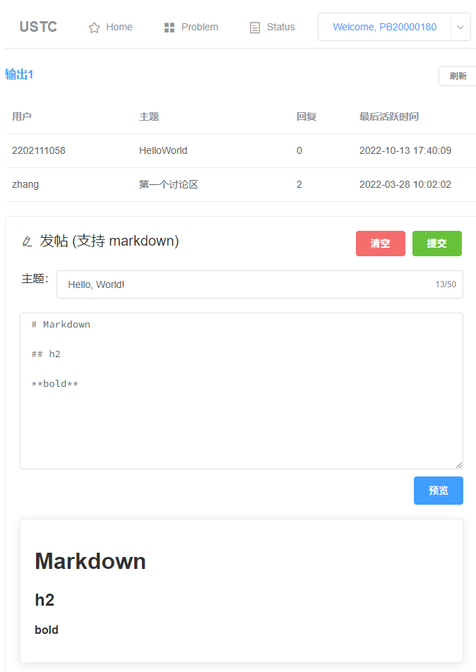
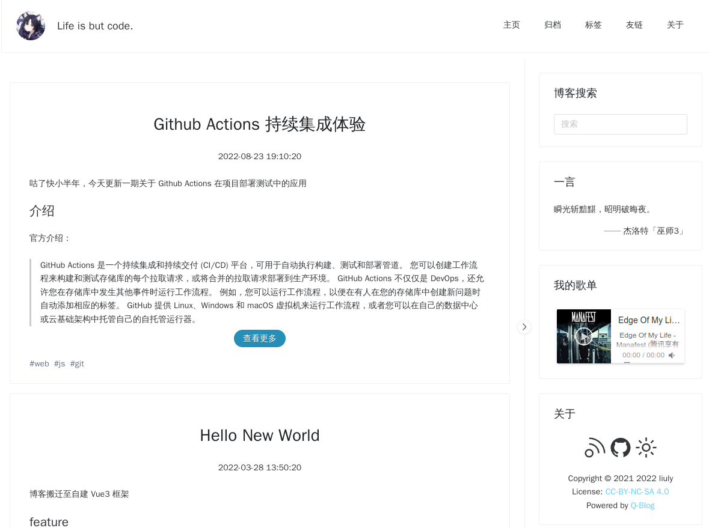
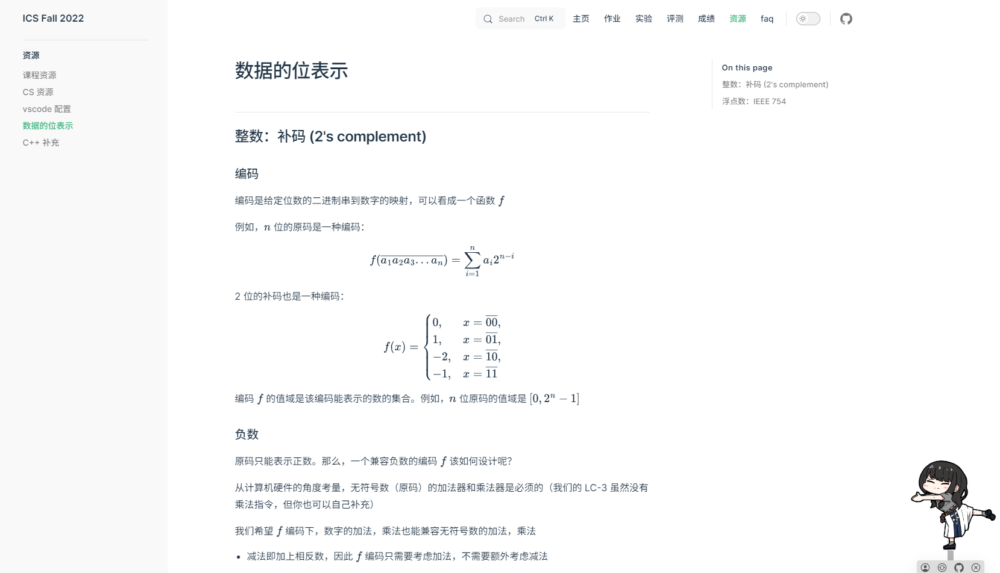

# 企划

课设及一些放在 GitHub 上的东西的介绍。大致按照时间顺序。

## 1. X-数独求解

大一下的程序设计二大作业。

Qt 写的 C++ 应用，实现了多线程和 A\* 搜索。

现在看起来有些地方代码挺累赘的，~~能跑就行~~。

[GitHub 链接](https://github.com/liuly0322/sudoku-game)。可以下载到 Windows 可用的 Release 版本。

## 2. 多项式计算器

数据结构小作业，那时还不会和 C++ 后端通信，用 php 调用 C++ CLI 写的。~~安全问题很大~~。

前端使用 MathJax 实现了数学公式的渲染。[GitHub 链接](https://github.com/liuly0322/USTC-CS-COURSE-HW/tree/main/%E6%95%B0%E6%8D%AE%E7%BB%93%E6%9E%84/hw1-%E5%A4%9A%E9%A1%B9%E5%BC%8F%E8%AE%A1%E7%AE%97%E5%99%A8)。

## 3. 航空订票系统

数据结构第一个大作业。

亮点大概是 CPP 写的后端？服务器逻辑是从开源项目来的，使用链表（实验要求）写了业务逻辑。[GitHub 链接](https://github.com/liuly0322/Flight-Server)。

## 4. 哈夫曼压缩

一个 CLI 的压缩工具，不过速度有点慢，当时也不会用 profiler 工具。[GitHub 链接](https://github.com/liuly0322/HuffmanCompress)。

## 5. LC-3 CPU

数字电路实验的大作业。

一个利用上 FPGA OL 平台的串口，LED 等硬件的小 LC-3 CPU。优点是代码比较精简，整体 CPU 代码不超过 200 行，缺点是现在回过头来看这也只是个「CPU 模拟器」罢了，没有数据通路，也没有中断，特权级这些机制，单纯的多周期状态机莽出来的。[GitHub 链接](https://github.com/liuly0322/USTC-CS-COURSE-HW/blob/main/%E6%95%B0%E5%AD%97%E7%94%B5%E8%B7%AF%E5%AE%9E%E9%AA%8C/labS/src/top.v)。

## 6. Verilog OJ

USTC 数字电路实验和计组会用。

我主要写了讨论区的前端部分。

[项目链接](https://verilogoj.ustc.edu.cn/oj/)。[GitHub 链接](https://github.com/YAVGroup/Verilog-OJ)。

## 7. 个人博客

一开始博客使用的是 hexo，主题是自己改的。主要用到了 jQuery 和 Stylus。

后来自己使用 Vite2 + Vue3 的起步模板构建了现在的博客。

- 写了个自动监听博客源 md 文件热更新的插件
- Vue3 + TypeScript 的组合式 API 应用
- 响应式布局
- 夜间模式

[博客链接](https://blog.liuly.moe/)。[GitHub 链接](https://github.com/liuly0322/Q-Blog)。

## 8. CODH 大作业

用 Verilog 实现的基于 RISC-V 的五级流水线 CPU。

- RV32I 和 RV32IC 指令补全。
- 两级动态 BHT 分支预测。
- L1d Cache。
- 交叉编译出了可以跑的贪吃蛇，生命游戏，井字棋。
- 持续集成，通过 RISC-V 官方提供的百余个正确性测试及指令相关测试的测试样例。

[详细介绍](https://liuly.moe/riscv32-ustc-codh-lab6/)。[项目链接](https://github.com/liuly0322/riscv32-ustc-codh-lab6)。

## 9. Realism OS

操作系统课程的大作业。此项目是与黄瑞轩、叶升宇、许坤钊同学共同完成的。

正如 [OSDev: Beginner Mistakes](https://wiki.osdev.org/Beginner_Mistakes) 这篇文章所说：

> No one who isn't already a seasoned developer with years of experience in several languages and environments should even be considering OS Dev yet. A decade of programming, including a few years of low-level coding in assembly language and/or a systems language such as C, is pretty much the minimum necessary to even understand the topic well enough to work in it.

从零开始写一个操作系统确实「野心」太大，最后我们小组在 [rCore](https://rcore-os.cn/rCore-Tutorial-Book-v3/) 的基础上做了点融合，进行了一个 Rust 语言实现微内核基本 IPC + 用户级线程模型的探索。[项目链接](https://github.com/OSH-2022/x-realism)。

## 10. 基金情绪分析与预测

这是我学习面向交叉学科的 Python 程序设计课程的大作业，与黄瑞轩、刘阳同学共同完成。

> 这个项目的背景是，随着支付宝、东方财富网购买基金功能的完善，越来越多的大学生加入了炒基金的行列。和传统炒股、炒基金模式不同的是，现在购买基金的 APP 往往提供“评论区”功能，用户可以发帖、回帖、分享自己的见解。这就给我们提供了基金相关的舆论信息，有了进行情感走势与基金净值走势的相关检验及长期走势的回归预报的可能。

本项目综合利用爬虫、情感分析、机器学习以及 pyqt 等图形库技术，对东方财富网基金吧内舆论进行情感走势与基金净值走势的相关检验，并进行长期走势的回归预报，将成果通过图形界面展示。

我负责了一些图形界面的实现。

## 11. lc3 自动评测及课程主页

lc3 是计算系统概论一课中介绍的一个简单 ISA。在修这门课时，我写了一个「评测机」来方便同学们检验自己代码正确性。

在一年后我带这门课助教时又进行了重构。

旧版：

新版：

新版用上了 Vue3，在重构代码之余还新增了一个追踪 pc，寄存器和内存变化的功能。

后将这个自动评测整合到了课程网站上。

课程网站在 Vitepress 模板的基础上魔改支持了自动评测，数学公式显示和一个搜索栏。并且额外增加了一只可爱的 Takina。

[课程网站链接](https://ics.liuly.moe)。 [GitHub 链接](https://github.com/liuly0322/ics)。

_顺便安利一下「蒜」(Lycoris Recoil)_

## 12. SysYF 编译器

编译原理的课程实验。

中间代码生成实验完成了一个 IRBuilder，对比标程个人觉得还是很简洁的，也没有使用过多的跨函数变量。例如控制流栈的结构放在函数栈上维护而非使用全局 stack；对变量访问一律先返回左值，由使用者自行转换，而不是使用全局变量指示该返回左值还是右值；写了一个很有用的类型转换辅助函数（可以顺便做到常量折叠）。

中间代码优化实验增添了稀疏条件常量传播，死代码消除两项优化，队友完成了公共子表达式消除的优化。

- 区分纯函数及纯函数具体改变的全局变量
  - 实现了基本块内全局变量安全的 store-load 转发（非纯函数调用可能会注销定值）
  - 提高了公共子表达式消除和死代码消除的性能
- 稀疏条件常量传播相比普通常量传播效果更好，考虑了不可达控制流
- 公共子表达式消除分类考虑了 load 指令
  - 局部变量已经被转化为 SSA 形式，不用考虑
  - 全局变量或局部数组可以由改变它的 call/store 指令注销
  - 全局数组或指针参数可以由任意非纯函数调用或 store 语句注销（难以追踪函数参数的来源）
- 死代码删除循环执行直到收敛
  - 支持控制流简化
  - 支持不可达基本块删除

使用 WASM 技术构建了一个 demo 网页，且融合到了 CI/CD Pipeline 中，每次仓库的新 push 操作会触发 wasm 文件的重新构建。

[demo 网页](https://liuly.moe/sysyf_compiler_codegen_opt/)。[GitHub 链接](https://github.com/liuly0322/sysyf_compiler_codegen_opt)。

## 13. 教师管理系统

数据库课设，喜闻乐见的管理系统，[GitHub 链接](https://github.com/liuly0322/teacher-management-system)。

算是 Node.js 全栈开发的一个 demo，用到了 Prisma ORM 进行数据库的访问，Nuxt 框架则提供了前端获取后端 api 接口类型（然后爽做 TypeScript 类型体操）等能力。

## 14. QQ 机器人相关

作为重度 QQ 用户，一直对 QQ 机器人很感兴趣。现在 QQ 官方并不鼓励第三方机器人的使用，下面提到的项目仅供参考。

- [L-Plugin](https://github.com/liuly0322/l-plugin)。起源是给一个基于 icqq 的原神机器人做的插件，支持了一些占卜/运行代码之类的功能。后来 icqq 寄了，原来的原神机器人也转到 [TimeRainStarSky/Yunzai](https://github.com/TimeRainStarSky/Yunzai) 维护了。
- [QQAutoGUISender](https://github.com/liuly0322/QQAutoGUISender)。一个网页端的匿名信息发送。后端需要在 Linux 桌面环境运行，因为是用 pyautogui 模拟鼠标点击实现的。

> 主流的 QQ bot 生态还是以 OneBot API 为主，可以理解为 OneBot 是一个跨聊天平台的机器人标准，只要对某个平台有了 OneBot 的实现就可以接入其丰富的生态。以前的 QQ bot 对它的实现以 icqq，go-cqhttp 为主，现在的 QQ bot 实现可以参考：[这个 issue](https://github.com/Mrs4s/go-cqhttp/issues/2471) 和 [LiteLoaderQQNT-OneBotApi](https://github.com/linyuchen/LiteLoaderQQNT-OneBotApi)。

## 15. FPGAOL

FPGAOL 是校内的数字电路实验平台，支持用户在线获取 FPGA 实例使用。

我的大创是对平台的改进，我主要负责了前端优化和新功能开发。新的平台支持自定义外设种类和数量。

## 16. Bilibili 会员购漫展信息收集

Bilibili 并不支持漫展信息的按时间排序，所以我们来造个轮子吧！

复刻了一下 Bilibili 的页面。

[网页链接](https://liuly.moe/BilibiliAnimationExhibitionInformationCollection/)，[数据](https://github.com/liuly0322/BilibiliAnimationExhibitionInformationCollection/tree/gh-pages) 是 [GitHub 仓库](https://github.com/liuly0322/BilibiliAnimationExhibitionInformationCollection/) 每天自动运行 GitHub Actions 爬出，存放到 gh-pages 分支的。

## 17. APlayer-ts

在造博客轮子的时候想优化打包速度，于是改了一下原来的 [APlayer](https://github.com/DIYgod/APlayer)。去除了多余的依赖；对某些功能进行了 opt-in 的 Tree-Shaking API 改写；增加了 TypeScript 类型声明。[仓库链接](https://github.com/liuly0322/aplayer-ts)。看到最后打包产物比一开始小了一半还是挺爽的，然后开始沉迷 rollup、esbuild、terser。。。

## 18. Rollup 的 Tree-Shaking 算法改进

给 Rollup 这个 JavaScript 打包工具做了点微小的 [PR](https://github.com/rollup/rollup/pull/5443)。

- [If a function is called only once, the parameters are basically the call arguments](https://rollupjs.org/repl/?version=4.17.2&shareable=JTdCJTIyZXhhbXBsZSUyMiUzQW51bGwlMkMlMjJtb2R1bGVzJTIyJTNBJTVCJTdCJTIyY29kZSUyMiUzQSUyMmZ1bmN0aW9uJTIwZm9vKG9iaiUyQyUyMGRlYnVnKSUyMCU3QiU1Q24lMjAlMjBpZiUyMChkZWJ1ZyklMjBjb25zb2xlLmxvZyhvYmopJTNCJTVDbiUyMCUyMCUyRiUyRiUyME5vdGUlMjB0aGF0JTIwYWNjZXNzaW5nJTIwb2JqLnZhbHVlJTIwaXMlMjBub3QlMjBjb25zaWRlcmVkJTIwYSUyMHNpZGUlMjBlZmZlY3QlMjBiZWNhdXNlJTVDbiUyMCUyMCUyRiUyRiUyMHdlJTIwa25vdyUyMHRoZSUyMHZhbHVlJTJDJTIwc28lMjB0aGUlMjB0ZXN0JTIwY29uZGl0aW9uJTIwY2FuJTIwYmUlMjByZW1vdmVkJTVDbiUyMCUyMGlmJTIwKG9iai52YWx1ZSklMjByZXR1cm4lMjBvYmoudmFsdWUlM0IlNUNuJTIwJTIwcmV0dXJuJTIwJ3dlJTIwbmV2ZXIlMjBnZXQlMjBoZXJlJyUzQiU1Q24lN0QlNUNuJTVDbiUyRiUyRiUyME5vdGUlMjBob3clMjB0aGUlMjBzZWNvbmQlMjBhcmd1bWVudCUyMGlzJTIwcmVtb3ZlZCUyMGFzJTIwaXQlMjBpcyUyMG5vJTIwbG9uZ2VyJTIwbmVlZGVkLiU1Q24lMkYlMkYlMjBJZiUyMHdlJTIwd291bGQlMjBub3QlMjByZXR1cm4lMjB0aGUlMjBmaXJzdCUyMGFyZ3VtZW50JTJDJTIwaXQlMjB3b3VsZCUyMGFsc28lMjBiZSUyMHJlbW92ZWQlNUNuY29uc29sZS5sb2coZm9vKCU3QnZhbHVlJTNBJTIwNDIlN0QlMkMlMjBmYWxzZSkpJTNCJTIyJTJDJTIyaXNFbnRyeSUyMiUzQXRydWUlMkMlMjJuYW1lJTIyJTNBJTIybWFpbi5qcyUyMiU3RCU1RCUyQyUyMm9wdGlvbnMlMjIlM0ElN0IlN0QlN0Q=)
- [A function can be called more than once if it is always called with the same constant variable or same primitive value](https://rollupjs.org/repl/?version=4.17.2&shareable=JTdCJTIyZXhhbXBsZSUyMiUzQW51bGwlMkMlMjJtb2R1bGVzJTIyJTNBJTVCJTdCJTIyY29kZSUyMiUzQSUyMmZ1bmN0aW9uJTIwZm9vKG9iaiUyQyUyMGRlYnVnKSUyMCU3QiU1Q24lMjAlMjBpZiUyMChkZWJ1ZyklMjBjb25zb2xlLmxvZyhvYmopJTNCJTVDbiUyMCUyMGlmJTIwKG9iai52YWx1ZSklMjByZXR1cm4lMjA0MiUzQiU1Q24lMjAlMjByZXR1cm4lMjAnd2UlMjBuZXZlciUyMGdldCUyMGhlcmUnJTNCJTVDbiU3RCU1Q24lNUNuY29uc3QlMjBjb25maWclMjAlM0QlMjAlN0J2YWx1ZSUzQSUyMHRydWUlN0QlM0IlNUNuY29uc3QlMjBlbmFibGVMb2dnaW5nJTIwJTNEJTIwZmFsc2UlM0IlNUNuJTVDbiUyRiUyRiUyMEl0JTIwaXMlMjBvayUyMHRvJTIwZWl0aGVyJTIwdXNlJTIwdGhlJTIwc2FtZSUyMGlkZW50aWZpZXIlMjBvciUyMHNvbWV0aGluZyUyMHRoYXQlMjByZXNvbHZlcyU1Q24lMkYlMkYlMjB0byUyMHRoZSUyMHNhbWUlMjBwcmltaXRpdmUlMjB2YWx1ZSUyMChib29sZWFuJTJDJTIwc3RyaW5nJTJDJTIwbnVtYmVyKSU1Q25jb25zb2xlLmxvZyhmb28oY29uZmlnJTJDJTIwZmFsc2UpKSUzQiU1Q25jb25zb2xlLmxvZyhmb28oY29uZmlnJTJDJTIwZW5hYmxlTG9nZ2luZykpJTNCJTVDbiU1Q24lMkYlMkYlMjBGb3IlMjBjb21wbGV4JTIwdmFsdWVzJTJDJTIwdXNpbmclMjB0aGUlMjBzYW1lJTIwb2JqZWN0JTIwc2hhcGUlMjBpcyUyMG5vdCUyMGVub3VnaC4lNUNuJTJGJTJGJTIwTm90ZSUyMGhvd2V2ZXIlMjB0aGF0JTIwdGhpcyUyMGxpbmUlMjB3b3VsZCUyMG9ubHklMjBkZW9wdGltaXplJTIwdGhlJTIwZmlyc3QlMjBwYXJhbXRlciU1Q24lMkYlMkYlMjBjb25zb2xlLmxvZyhmb28oJTdCdmFsdWUlM0ElMjB0cnVlJTdEJTJDJTIwZmFsc2UpKSUzQiUyMiUyQyUyMmlzRW50cnklMjIlM0F0cnVlJTJDJTIybmFtZSUyMiUzQSUyMm1haW4uanMlMjIlN0QlNUQlMkMlMjJvcHRpb25zJTIyJTNBJTdCJTIyb3V0cHV0JTIyJTNBJTdCJTIyZm9ybWF0JTIyJTNBJTIyZXMlMjIlN0QlN0QlN0Q=)
- [If the function is used any other way except in calls, all parameters will be deoptimized](https://rollupjs.org/repl/?version=4.17.2&shareable=JTdCJTIyZXhhbXBsZSUyMiUzQW51bGwlMkMlMjJtb2R1bGVzJTIyJTNBJTVCJTdCJTIyY29kZSUyMiUzQSUyMmZ1bmN0aW9uJTIwZm9vKG9iaiUyQyUyMGRlYnVnKSUyMCU3QiU1Q24lMjAlMjBpZiUyMChkZWJ1ZyklMjBjb25zb2xlLmxvZyhvYmopJTNCJTVDbiUyMCUyMGlmJTIwKG9iai52YWx1ZSklMjByZXR1cm4lMjA0MiUzQiU1Q24lMjAlMjByZXR1cm4lMjAnd2UlMjBuZXZlciUyMGdldCUyMGhlcmUnJTNCJTVDbiU3RCU1Q24lNUNuJTJGJTJGJTIwVGhpcyUyMGRlb3B0aW1pemVzJTIwYWxsJTIwcGFyYW1ldGVycyUyMGFzJTIwd2UlMjBjYW4lMjBubyUyMGxvbmdlciUyMG1ha2UlNUNuJTJGJTJGJTIwYXNzdW1wdGlvbnMlMjBob3clMjB0aGUlMjBmdW5jdGlvbiUyMGlzJTIwY2FsbGVkLiU1Q25nbG9iYWwuZm9vJTIwJTNEJTIwZm9vJTNCJTIyJTJDJTIyaXNFbnRyeSUyMiUzQXRydWUlMkMlMjJuYW1lJTIyJTNBJTIybWFpbi5qcyUyMiU3RCU1RCUyQyUyMm9wdGlvbnMlMjIlM0ElN0IlMjJvdXRwdXQlMjIlM0ElN0IlMjJmb3JtYXQlMjIlM0ElMjJlcyUyMiU3RCU3RCU3RA==)

能把函数调用参数传播到函数体内部。具体分析可以看 [这篇博客](https://blog.liuly.moe/posts/specialization)。
