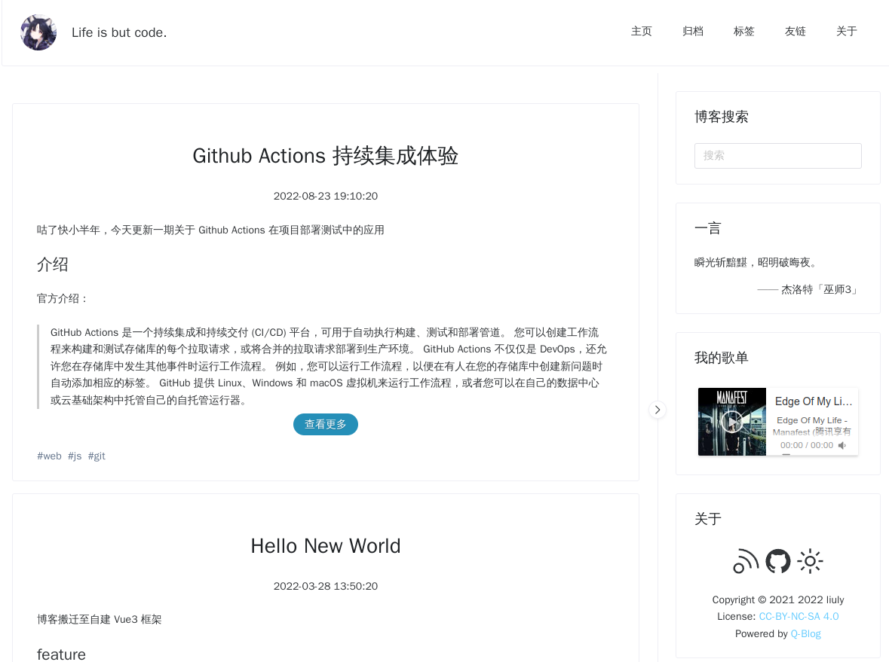
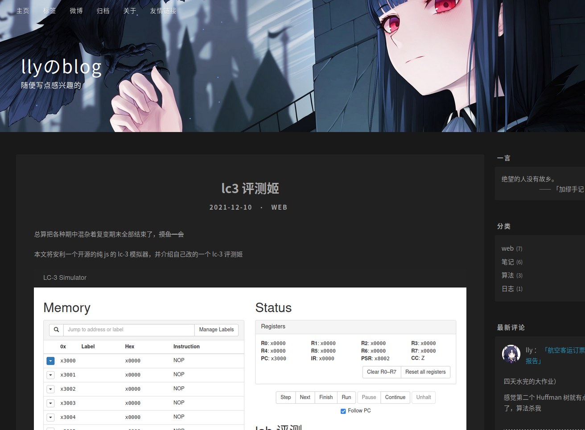
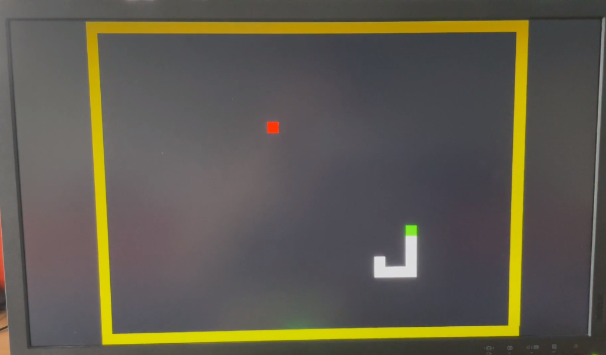
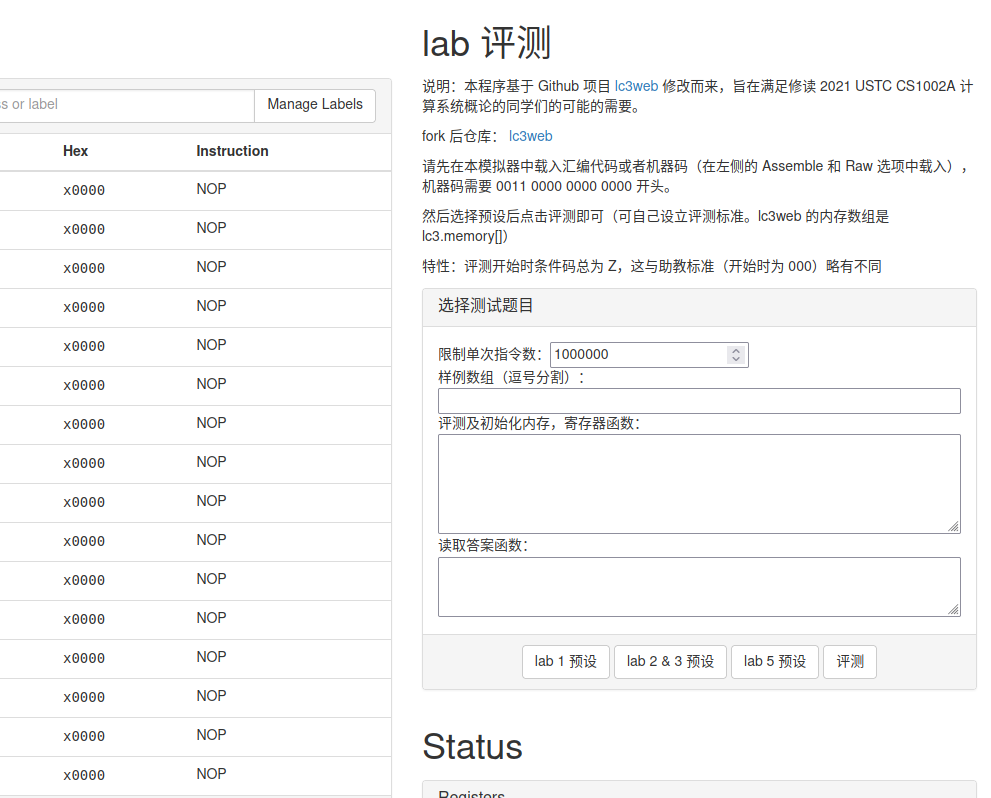
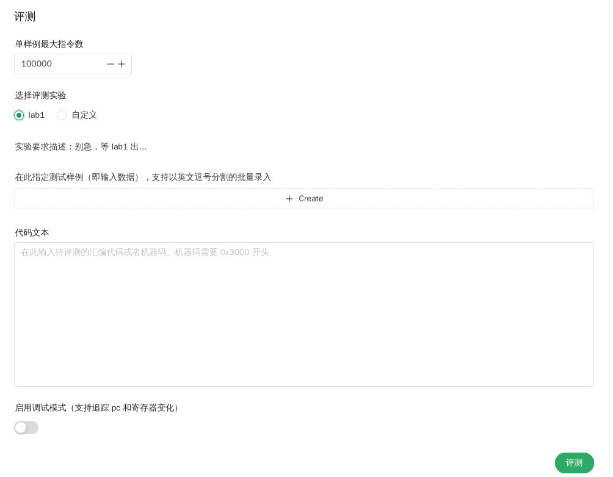
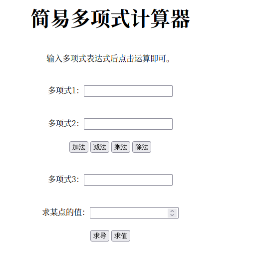
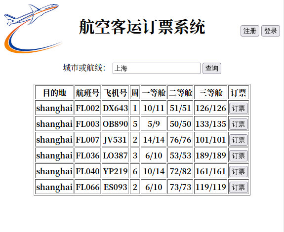
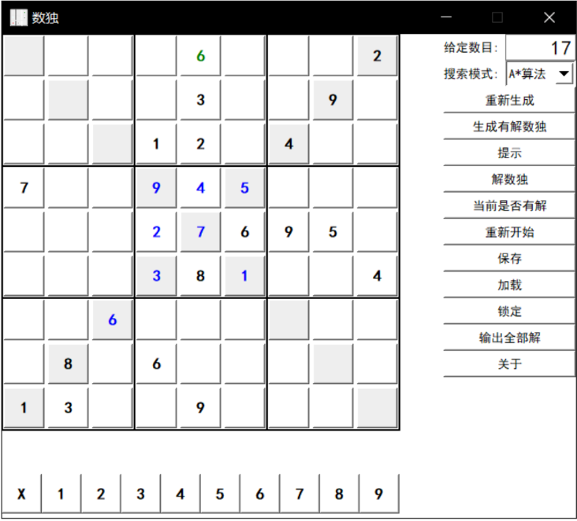

# 项目

介绍下零零散散做的一些有点意思的东西

## 个人博客

项目链接：<https://github.com/liuly0322/Q-Blog>

- Vite 热更新，写了个自动监听博客源 md 文件热更新的插件
- Vue3 + TypeScript 的组合式 API 应用，computed 是好文明
- 响应式布局/夜间模式



原有的 hexo 博客：<http://home.ustc.edu.cn/~liuly0322/blog/> 的主题也是自己改的，还算满意，这个项目还是在刚入坑前端的时候写的，基本都是 Vanilla JS/CSS



## CODH 大作业

这个太复杂了，懒得概括，上链接 <https://blog.liuly.moe/riscv32-ustc-codh-lab6/>

- RV32I 和 RV32IC 指令补全
- 两级动态 BHT 分支预测
- L1d Cache
- 交叉编译出了可以跑的贪吃蛇，生命游戏，井字棋



~~遗憾没有拿 4.3~~

## lc3 自动评测

两个版本，分别是一年前和一年后写的

一年后用上了 Vue 还用上了 es6 提供的 import/export，写起来明显比一个个

```js
document.querySelector('...')
```

爽，突出一个快乐（）

旧版：



新版：



新版的代码干净了很多，新增了一个追踪 pc 和寄存器变化的功能

很适合需要学 _Introduction to Computing Systems_ （USTC 限定）课程的同学使用

## Verilog OJ

USTC 数字电路实验和计组会用

<https://verilogoj.ustc.edu.cn/oj/>

项目地址：

<https://github.com/YAVGroup/Verilog-OJ>

基本只摸了个讨论区的前端部分，虽然好像没啥人用

## 数据结构作业

马老师的 ~~我大意了啊，没有闪~~ 数据结构能做点 project 其实还是比较快乐的，虽然以现在的眼光看都挺水的

### 多项式计算器

数据结构小作业，那时还不会前后端通信，嗯是用 php 调用 C++ 写的，~~安全问题很大~~



感想是 MathJax 真不如 Katex

### 航空订票系统

亮点大概是 CPP 写的后端？不过服务器逻辑是从开源项目来的，只使用链表（实验要求）写了业务逻辑



### 哈夫曼压缩

一个 CLI 的压缩工具，不过超级慢，[链接](https://github.com/liuly0322/HuffmanCompress)

## X-数独求解

大一下的程序设计二大作业

Qt 写的 C++ 应用，实现了多线程和 A* 搜索


