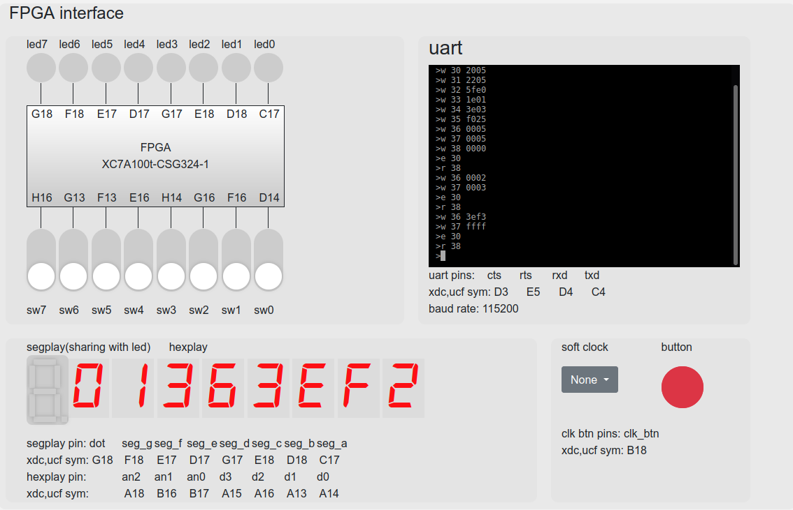
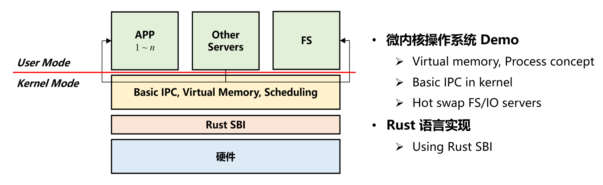
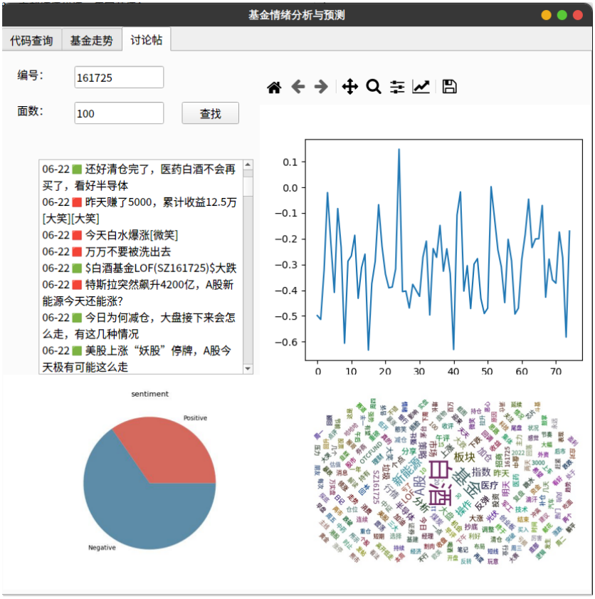
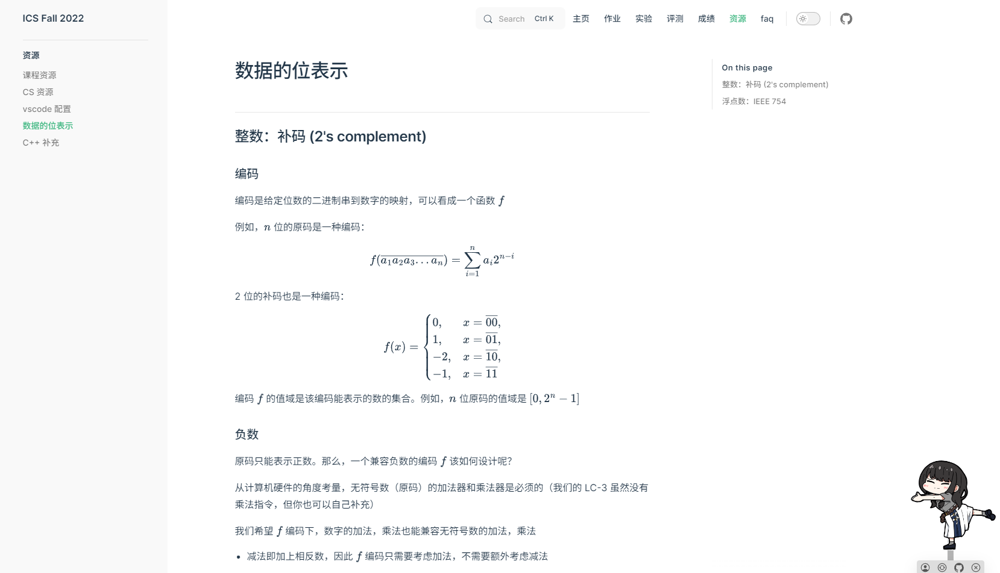

# 项目

介绍下零零散散做的一些有点意思的东西。大致按照时间顺序。

## 1. X-数独求解

大一下的程序设计二大作业。

项目链接：<https://github.com/liuly0322/sudoku-game>。

Qt 写的 C++ 应用，实现了多线程和 A\* 搜索。

现在看起来有些地方代码挺累赘的，~~能跑就行~~。

## 2. 多项式计算器

[项目链接点我](https://github.com/liuly0322/USTC-CS-COURSE-HW/tree/main/%E6%95%B0%E6%8D%AE%E7%BB%93%E6%9E%84/hw1-%E5%A4%9A%E9%A1%B9%E5%BC%8F%E8%AE%A1%E7%AE%97%E5%99%A8)。数据结构小作业，那时还不会前后端通信，嗯是用 php 调用 C++ 写的，~~安全问题很大~~。

感想是 MathJax 真不如 Katex。

## 3. 航空订票系统

数据结构第一个大作业。

项目链接：<https://github.com/liuly0322/Flight-Server>。

亮点大概是 CPP 写的后端？不过服务器逻辑是从开源项目来的，只使用链表（实验要求）写了业务逻辑。

## 4. 哈夫曼压缩

项目链接：<https://github.com/liuly0322/HuffmanCompress>。

一个 CLI 的压缩工具，不过超级慢，当时也不会用 profiler 工具来着。

## 5. LC-3 CPU

数字电路实验的大作业。

一个利用上 FPGA OL 平台的串口，LED 等硬件的小 LC-3 CPU。优点是 [代码](https://github.com/liuly0322/USTC-CS-COURSE-HW/blob/main/%E6%95%B0%E5%AD%97%E7%94%B5%E8%B7%AF%E5%AE%9E%E9%AA%8C/labS/src/top.v) 比较精简，整体 CPU 代码不超过 200 行，缺点是现在回过头来看这也只是个 「CPU 模拟器」 罢了，没有数据通路，也没有中断，特权级这些机制，单纯的多周期状态机莽出来的。

## 6. Verilog OJ

USTC 数字电路实验和计组会用。

<https://verilogoj.ustc.edu.cn/oj/>

项目地址：

<https://github.com/YAVGroup/Verilog-OJ>

我在其中基本只摸了个讨论区的前端部分，虽然好像没啥人用。

## 7. 个人博客

项目链接：<https://github.com/liuly0322/Q-Blog>。

- Vite 热更新，写了个自动监听博客源 md 文件热更新的插件。
- Vue3 + TypeScript 的组合式 API 应用，computed 是好文明。
- 响应式布局/夜间模式。

原有的 hexo 博客：<http://home.ustc.edu.cn/~liuly0322/blog/> 的主题也是自己改的，还算满意，这个项目还是在刚入坑前端的时候写的，基本都是 Vanilla JS/CSS。

## 8. CODH 大作业

这个太复杂了，懒得概括，上链接 <https://liuly.moe/riscv32-ustc-codh-lab6/>。

- RV32I 和 RV32IC 指令补全。
- 两级动态 BHT 分支预测。
- L1d Cache。
- 交叉编译出了可以跑的贪吃蛇，生命游戏，井字棋。

~~遗憾没有拿 4.3~~

## 9. Realism OS

操作系统课程的大作业。此项目是与黄瑞轩、叶升宇、许坤钊同学共同完成的。[项目代码](https://github.com/OSH-2022/x-realism)。

正如 [OSDev: Beginner Mistakes](https://wiki.osdev.org/Beginner_Mistakes) 这篇文章所说：

> No one who isn't already a seasoned developer with years of experience in several languages and environments should even be considering OS Dev yet. A decade of programming, including a few years of low-level coding in assembly language and/or a systems language such as C, is pretty much the minimum necessary to even understand the topic well enough to work in it.

从零开始写一个操作系统确实 「野心」 太大，最后我们小组在 [rCore](https://rcore-os.cn/rCore-Tutorial-Book-v3/) 的基础上做了点融合，进行了一个 Rust 语言实现微内核基本 IPC + 用户级线程模型的探索。

## 10. 基金情绪分析与预测

这是我学习面向交叉学科的 Python 程序设计课程的大作业，与黄瑞轩、刘阳同学共同完成。

> 这个项目的背景是，随着支付宝、东方财富网购买基金功能的完善，越来越多的大学生加入了炒基金的行列。和传统炒股、炒基金模式不同的是，现在购买基金的 APP 往往提供 “评论区” 功能，用户可以发帖、回帖、分享自己的见解。这就给我们提供了基金相关的舆论信息，有了进行情感走势与基金净值走势的相关检验及长期走势的回归预报的可能。

本项目综合利用爬虫、情感分析、机器学习以及 pyqt 等图形库技术，对东方财富网基金吧内舆论进行情感走势与基金净值走势的相关检验，并进行长期走势的回归预报，将成果通过图形界面展示。

我负责了一些图形界面的实现。

## 11. lc3 自动评测

项目链接：<https://github.com/liuly0322/ics>。现在作为我带的 ICS 助教的课程主页。

两个版本，分别是一年前和一年后写的。

一年后用上了 Vue，还用上了 es6 提供的 import/export。

旧版：

新版：

新版的代码干净了很多，新增了一个追踪 pc，寄存器和内存变化的功能。

很适合需要学 _Introduction to Computing Systems_ （USTC 限定）课程的同学使用。

后来我任 2022 秋季学期 ICS 助教时将这个自动评测整合到了 [课程网站](https://ics.liuly.moe) 上。

课程网站在 Vitepress 模板的基础上魔改支持了自动评测，数学公式显示和一个搜索栏。并且额外增加了一只可爱的 Takina。

_顺便安利一下「蒜」(Lycoris Recoil)_

## 12. SysYF 编译器

编译原理的课程实验。链接：<https://github.com/liuly0322/sysyf_compiler_codegen_opt>。

中间代码生成实验完成了一个 IRBuilder，对比标程个人觉得还是很简洁的，也没有使用过多的跨函数变量。例如控制流栈的结构放在函数栈上维护而非使用全局 stack；对变量访问一律先返回左值，由使用者自行转换，而不是使用全局变量指示该返回左值还是右值；写了一个很有用的类型转换辅助函数（可以顺便做到常量折叠）。

中间代码优化实验增添了稀疏条件常量传播，死代码消除两项优化，队友完成了公共子表达式消除的优化。

- 区分纯函数及纯函数具体改变的全局变量
  - 实现了基本块内全局变量安全的 store-load 转发（非纯函数调用可能会注销定值）
  - 提高了公共子表达式消除和死代码消除的性能
- 稀疏条件常量传播相比普通常量传播效果更好，考虑了不可达控制流
- 公共子表达式消除分类考虑了 load 指令
  - 局部变量已经被转化为 SSA 形式，不用考虑
  - 全局变量或局部数组可以由改变它的 call/store 指令注销
  - 全局数组或指针参数可以由任意非纯函数调用或 store 语句注销（难以追踪函数参数的来源）
- 死代码删除循环执行直到收敛
  - 支持控制流简化
  - 支持不可达基本块删除

此外，在项目构建上，引入了 `.clang-format`，提高了整体项目代码的可读性。
